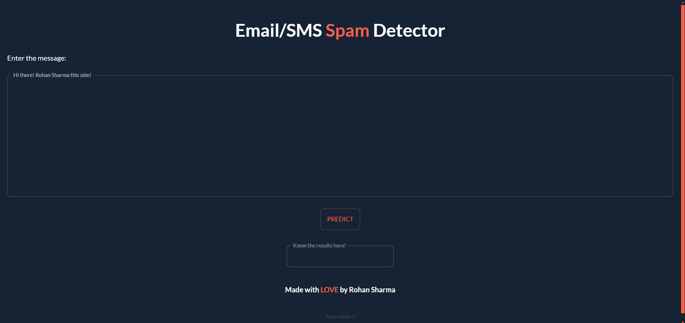
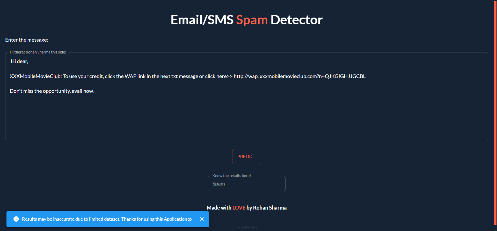
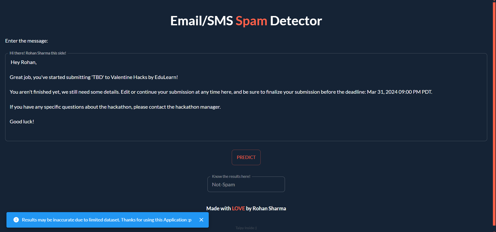

<p align="right">
    
</p>
<p align="center">
  
</p>


### EMAIL-SMS SPAM DETECTOR
- Email-sms spam detector is a NLP(Natural Language Processing) and ML(Machine Learning) project.
- This project/application can help you to classify the spam/ham(not spam) messages dropped either as a mail or a SMS.


### :books: Index

- [Demo](#movie_camera-Demo)
- [Screenshots](#screenshots)
- [Set Up](#outbox_tray-Set-up)
- [Contribute](#building_construction-Contribute)
- [Project Author](#people_holding_hands-Meet-the-Author)
- [Contact](#email-contact)


###  :movie_camera: Demo
- After a brief introduction, let's dive a little more inside the project.
- Here is the walk-through of EMAIL-SMS Detector project.

https://github.com/RS-labhub/Email-Spam-Detection/assets/117426013/d315378d-fc2f-4def-a3fc-ec330fda6e53

<p align="center">Video Demonstration</p>

### Screenshots
<p align="center">
  
  
  
</p>


$~$

###  :outbox_tray: Set up
- These are the steps required to install the project.
- To get the model, run all the .ipynb files. Or you can directly proceed with the following steps:


1. Clone the Repository: Open a terminal or command prompt and clone the EMAIL-SMS-Detector repository from GitHub using the following command:

  ```bash
    git clone https://github.com/RS-labhub/Email-Spam-Detection.git
  ```

2. Navigate to the Repository Directory: Change your current directory to the cloned EMAIL-SMS-Detector repository:

  ```bash
    cd EMAIL-SMS-Detector
  ```

3. Install Dependencies: Use pip to install the required Python dependencies listed in the requirements.txt file:

  ```bash
    pip install -r requirements.txt
  ```

4. Run EMAIL-SMS-Detector application using the following command:

  ```py
    run spam_detector_taipy.py
  ```

5. Once the application is running, open a web browser and navigate to the specified address, and yeah! you're all set to use the EMAIL-SMS-Detector application.
<p align="center">
  The running port should look like this
</p>
<p align="center">

</p>


## Usage
Once EMAIL-SMS-Detector is installed and running, you can use it to check the spam/non-spam messages, input your message in the provided text-area, and get to know the results after clicking on the Predict button.


$~$
    
**Set Up Your Environment**

1. `Fork` our repository to your GitHub account. 
2. `Clone` your fork to your local machine. 
    Use the command `git clone https://github.com/RS-labhub/Email-Spam-Detection.git`.
3. Create a new branch for your work. 
    Use a descriptive name, like `fix-login-bug` or `add-user-profile-page`.
    
**Commit Your Changes**

- Commit your changes with a _clear commit message_. 
  e.g `git commit -m "Fix login bug by updating auth logic"`.

**Submit a Pull Request**

- Push your branch and changes to your fork on GitHub.
- Create a pull request, compare branches and submit.
- Provide a detailed description of what changes you've made and why. 
  Link the pull request to the issue it resolves. 🔗
    
**Review and Merge**

- I will review your pull request and provide feedback or request changes if necessary. 
- Once your pull request is approved, we will merge it into the main codebase 🥳

$~$

### :people_holding_hands: Meet the Author


### :email: Contact 
- Email and social media links.
- Head over to my github handle form [here](https://github.com/RS-labhub)

<p align="left">
<a href="https://twitter.com/rrs00179" target="blank"></a>
</p>
<p align="left">
<a href="https://www.linkedin.com/in/rohan-sharma-9386rs/" target="blank"></a>
</p>

<p align="center">
  Readme created with the help of <a href="https://github.com/quine-sh/README-Template/blob/main/README.md" alt="https://github.com/quine-sh/README-Template/blob/main/README.md">Quine</a>
</p>
