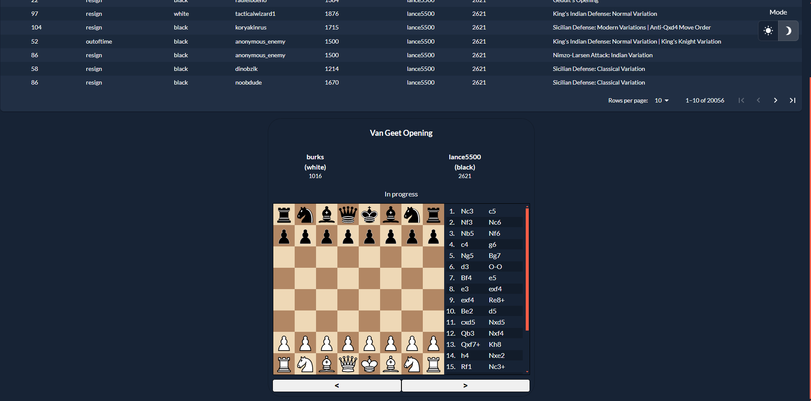
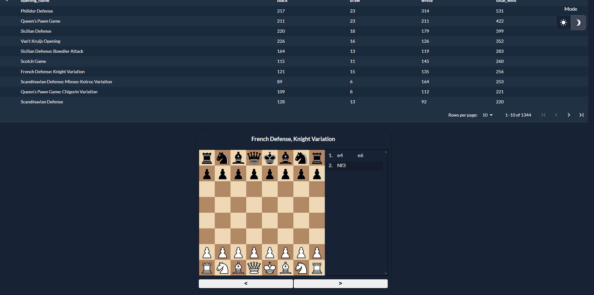
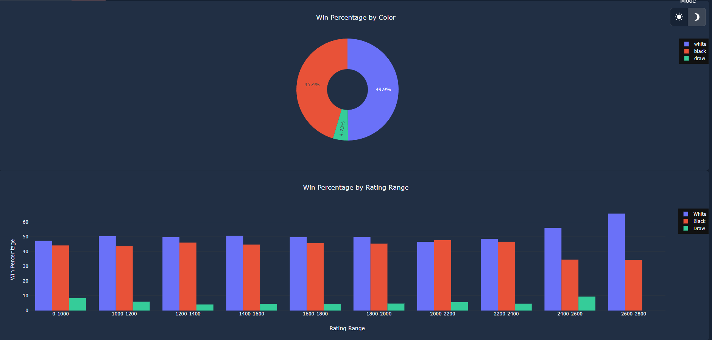
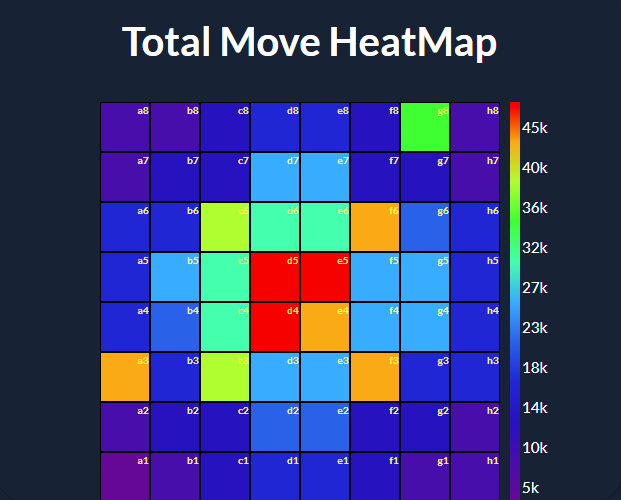

# Taipy Chess

## Table of Contents

- [Features](#features)
- [Demo](#demo)
- [Description](#description)
- [Installation](#installation)
- [Background](#background)

## Description

Taipy-Chess, is a chess visualization tool, based on 20,000 games. You can see all the games, the openings they played, opponents, top played openings and most successful openings. You can see heatmaps and charts on the data. This app was built using the [taipy](https://taipy.io) framework for easy data analysis and visualization.

## Features

- See a variety of chess games!
- See the most popular openings!
- See the chess board heatmap!
- See the most successful openings!
- See the chessboard heatmap!
- Get to learn more about different players!

## Demo


https://github.com/KorieDrakeChaney/taipy-chess/assets/92071726/c25fb773-124c-4836-bf0a-8bd80b2d5d14


## Screenshots

|               |    |         |
| --------------------------------------- | ---------------------------------- | --------------------------------- |
| **Check out a variety of chess games!** | **See the most popular openings!** | **Get to learn more about chess** |

## Heatmaps

|  |   |  |
| -------------------------------------- | ------------------------------------------- | --------------------------------------------- |
| **Check out the total move heatmap**   | **Check out the first moves made by pawns** | **Check out the first moves made by knights** |

## Installation

- Clone the repository:

  ```bash
  git clone https://github.com/KorieDrakeChaney/taipy-chess.git && cd taipy-chess
  ```

- Install the requirements:

  ```bash
  pip install -r src/requirements.txt
  ```

- Set up the Chess Library:

  - Set your directory to 'src/chess_library/front-end/':

    ```bash
    cd src/chess_library/front-end/
    ```

  - Install the requirements:

    ```bash
    npm install
    ```

  - Now build:
    ```bash
    npm run build
    ```

- Run the app:

  - Go back to root directory:

    ```bash
    cd ../../../
    ```

  - Run the app:
    ```bash
    python src/main.py
    ```

## Background

I have never done a Creator Quest before. I never even heard of it, until 2 days ago after reading this blog [post](https://medium.com/@bap_16778/5-achievable-side-hustles-for-developers-946c7cad1ff2). I checked it out, and saw a live creator quest, to my surprise, it only had a couple days before it ended. I wanted to challenge myself to see if I can learn a new [technology](https://taipy.io) and build something with it in a couple days. I was able to do it, and I'm proud of myself. I hope you enjoy my project. :smile:
