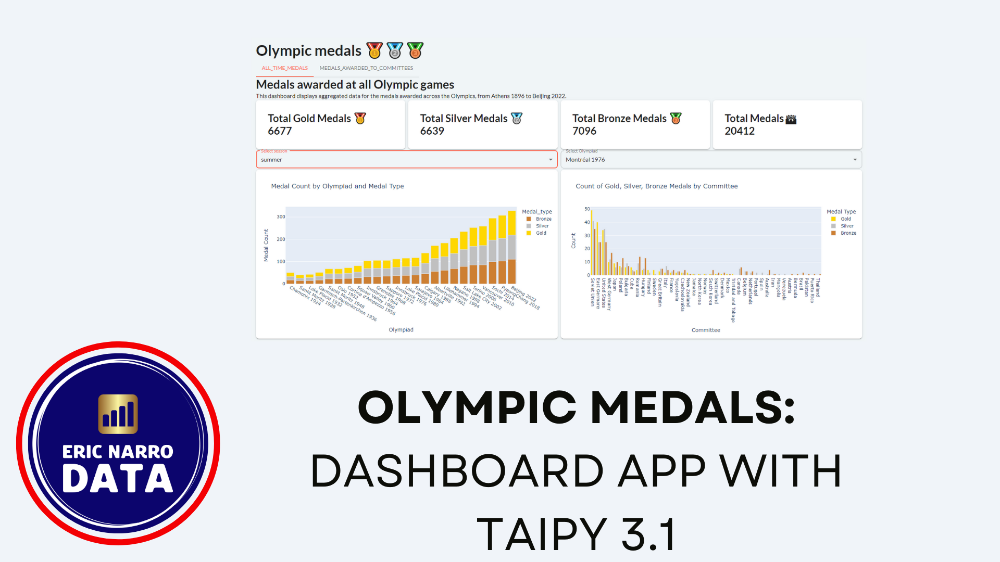

# 🥇🥈🥉 Olympic medals

## Introduction and context

Welcome to **Olympic Medals**, a simple Taipy dashboard that shows information about Olympic medals awarded from the beginning of modern Olympic games until the beginning of the year 2024 (this is, the Paris Olympics 2024 are not included). The dashboard has two tabs:

* A tab shows aggregated data for all Olympic medals
* A second tab focuses on medals won by Olympic committees (countries, but also special committees, such as the Refugee committee and so on)

The following video presents the dashboard:

**Context**: This is a demonstration application. It uses **Taipy 3.1**, released a week before writing these lines. Coding this application allowed me to compare it with previous versions of Taipy, I coded a [similar dashboard about wine production in France](https://github.com/enarroied/taipy_wine_app) using Taipy 3.0.

The main change of Taipy 3.1 is the way you apply the GUI elements. They replaced their unique Markdown syntax by a more pythonic system that relies on functions. This is what I wanted to test. This project does **not** use Taipy Core.

## Features

* Multi-Page Dashboard: Switch between tabs; the application has two pages.
* Several types of charts: Bar charts, sunburst charts, line charts, choropleth maps and grid charts.
* Dynamic Data Updates: The dashboard dynamically updates data based on the selected year and area type. 
* The app has different types of selectors.

## Getting Started

### Installation

Ensure you have the required dependencies installed. You can install them using the following:

`pip install -r requirements.txt`

The app uses Pandas and Plotly.

## Data

This application uses data from 2 CSV files. You can find them in the `data` repository.

Both datasets are available on Kaggle with complete references:

* [Olympic medals](https://www.kaggle.com/datasets/ericnarro/all-olympic-medals-until-2024-before-paris-games) has all the medals (gold, silver, bronze) awarded at all Olympics.
* [Olympic cities](https://www.kaggle.com/datasets/ericnarro/olympic-cities-summary) has the geographical information about the Olympic cities (the app has maps). it also has some summary information about each Olympic game.
