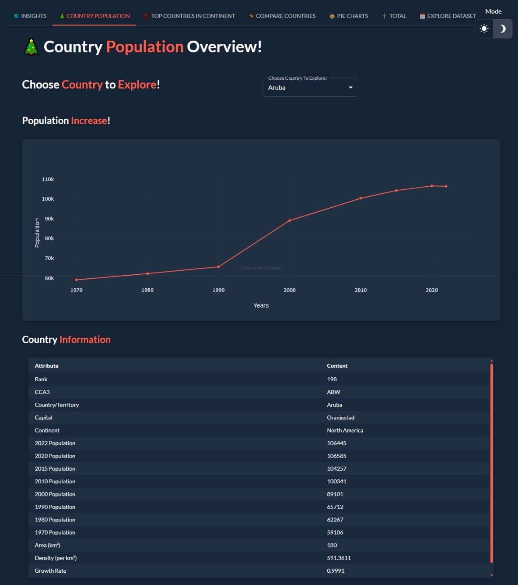

# 🌍 World Population Exploration!

> <strong>Explore world population data with this Python [app](https://world-population.taipy.cloud/) built on the [Taipy](https://taipy.io) framework for easy data analysis and visualization.</strong>

## 🚀 Features

- Get **insights** into world population trends 
- **Compare** country populations over time
- Dive into population **stats** for each country 
- Explore population in **Continent** with its childs
- Light and dark **theme** supported
- Get **Geographical** data of countries
- Responsive **UI** and UX
- Interactive **Pie** charts to visualize data
- Filterable **list** of countries by continent 
- See total world population **year-over-year**

---

## 🎥 Live Demo

##### You can check out a live demo here: 
- #### [🌐 https://world-population.taipy.cloud/](https://world-population.taipy.cloud/)

## 📊 Screenshots

<table>
<tr>
<td>
  
  
  
  **🌏 Insights**
  
</td>
</tr>
<tr>
<td>
  
  
  
  **🎄 Country Population**
  
</td>
</tr>
<tr>
<td>
  
  
  
  **💯 Top Countries in Continent**
  
</td>
</tr>
<tr>
<td>
  
  
  
  **⚡ Compare Countries**
  
</td>
</tr>
<tr>
<td>
  
  
  
  **🥧 Pie Charts**
  
</td>
</tr>
<tr>
<td>
  
  
  
  **➕ Total Population**
  
</td>
</tr>
<tr>
<td>
  
  
  
  **📅 Explore Dataset**
  
</td>
</tr>
<tr>
<td>
  
  
  
  **📱 Mobile Preview**
  
</td>
</tr>
</table>

---

## 🤝 Contributing
> Contributions of any kind are welcome! 

- 👯 Clone && star this repo and send  pull request!

- ✨ Submit pull requests to suggest code changes

- 🐛 Find a bug? Report bugs by opening an issue 

- 📢 Give feedback on existing issues and pulls

## 📝 Summary

This app makes **exploring world population** data easy and engaging. Built on the powerful Taipy library, it enables moderate analysis with minimal code.

---

<strong>Give this repo a ⭐ if you found it useful!</strong>

---

©Dataset Provided By <a href="https://kaggle.com">Kaggle</a>

