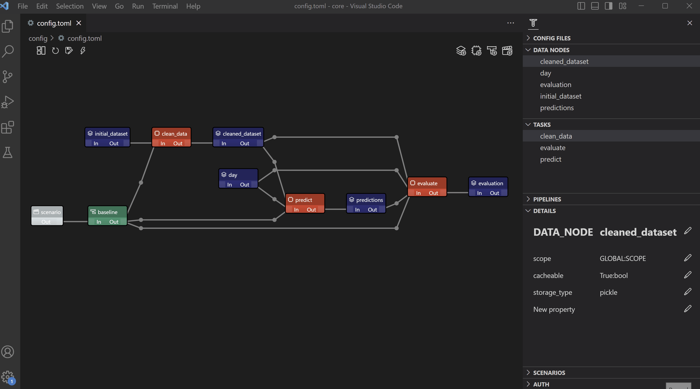
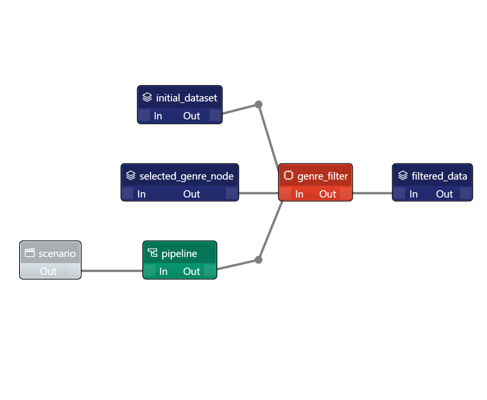
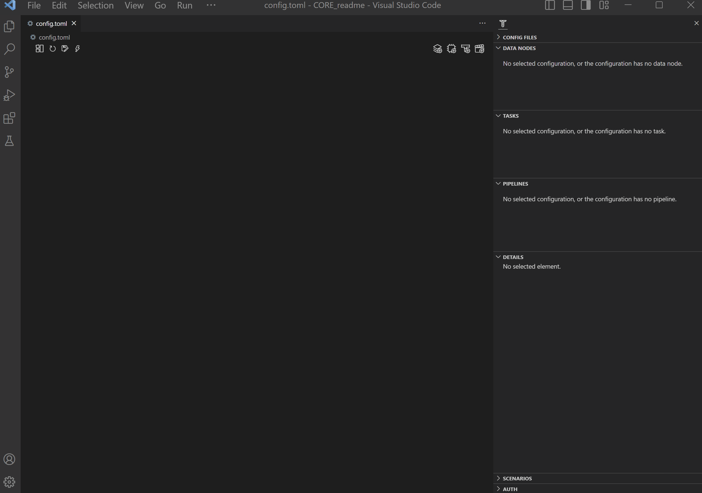
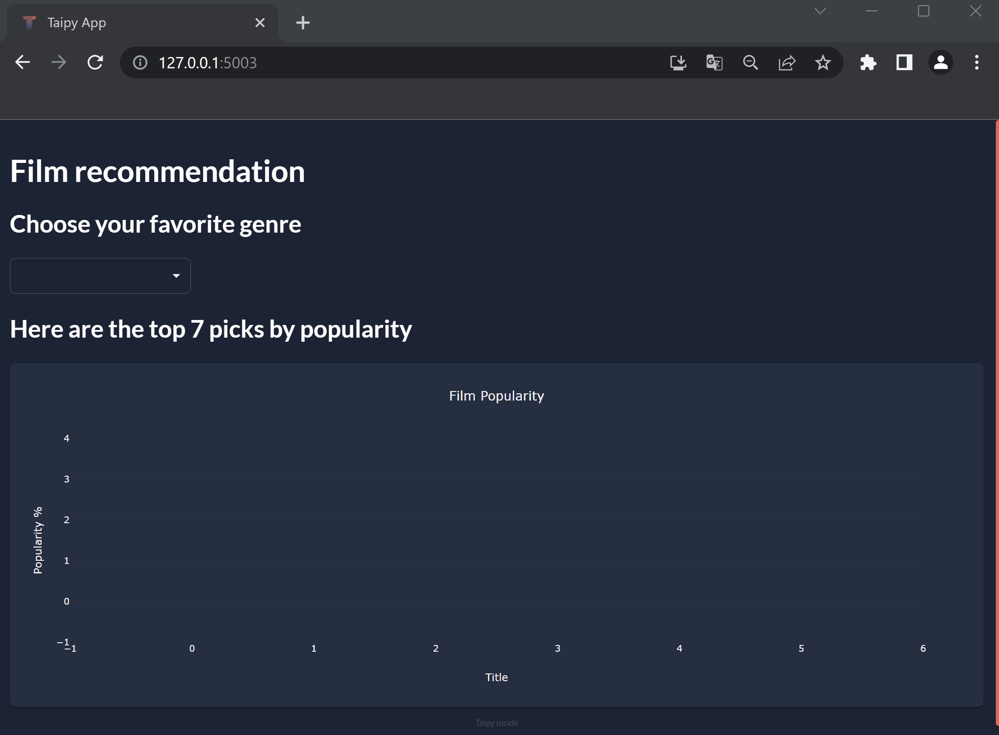

<br>
<br>

</img>
<br>
#  Welcome to Taipy
<p align="left">
    <a href="https://pypi.python.org/pypi/taipy/" alt="Taipy version">
        </a>
    <a href="https://pypi.org/project/taipy" alt="Python version">
        </a>
    <a href="https://www.youtube.com/@taipy8009" alt="YouTube">
        </a>
     <a href="https://twitter.com/Taipy_io" alt="Twitter">
        </a>


<br>

###  <div align="left">Turns Data and AI algorithms into full web applications in no time.
###  How? Taipy GUI with Taipy Core pops out as a 360° platform to build production-ready web applications</div>


<br>
<br>

###  <div align="left">*Open Source, 100% Python*</div>


<br>
<br>
<br>

#  <div align="center"> 📊 We make both ends meet ⚙️ </div>
<br>
 <div align="center">

| TAIPY GUI - the frond-end  | TAIPY Core - the back-end |
| --------  | -------- |
| | 


</div>

<br>
<br>

## Installation

Open a terminal and run:

```bash
$ pip install taipy
```

*You're all set! All aboard the Taipy journey 🚂*

<br>

## Community

Join our [Discord](https://discord.gg/XcFhrJZru3) to give us feedback, share your creations or just to have a chat with us.

<br>

## Ready, Set, GUI

### Tiny Taipy GUI Demo

```python
from taipy import Gui

excitement_page = """
# Welcome to Taipy
## Getting started with Taipy GUI
### How excited are you to try Taipy?

<|{excitement}|slider|min=1|max=100|>

My excitement level: <|{excitement}|text|>
"""
excitement = 100

Gui(page=excitement_page).run()
```
*RUN*🏃🏽‍♀️
<div align="center">🎊 TA-DA! 🎊</div>
<br>
<div align="center"></img></div>

<br>
<br>

### <div align="center">*Find out more*</div>
*<div align="center">Check out our [Getting Started](https://docs.taipy.io/en/latest/getting_started/getting-started-gui/) and [Documentation](https://docs.taipy.io/en/latest/manuals/gui/)</div>*

<br>
<br>

## EN-CORE?

#### <div align="center">Let's create a back-end execution, also called *scenario* using Taipy Core. Our scenario will filter movie data based on the genre you choose. This scenario will be submitted (i.e., executed) each time the genre selection changes and output the seven most popular movies of that genre. </div>
<br>

*Here is our filter function: a standard Python function that is used by the unique task in the scenario*
```python
def filter_genre(initial_dataset: pd.DataFrame, selected_genre):
    filtered_dataset = initial_dataset[initial_dataset['genres'].str.contains(selected_genre)]
    filtered_data = filtered_dataset.nlargest(7, 'Popularity %')
    return filtered_data
```

*This is the execution graph of the scenario we are implementing*

<div align="center"></div>


### Taipy Studio - The easy peasy way
*You can use the Taipy Studio extension in VSCode to configure your sequence with no code*

<div align="center"></img></div>

*Your configuration is automatically saved as a TOML file*

<br>
<br>

### <div align="center">*Find out more*</div>
*<div align="center">Check out our [Getting Started](https://docs.taipy.io/en/latest/getting_started/getting-started-core/) and [Documentation](https://docs.taipy.io/en/latest/manuals/studio/) </div>*

<br>
<br>
<br>
<br>

### Taipy Core - a walk on the code side
<div align="left">For more advanced use cases or if you prefer coding your configurations instead of using Taipy Studio, Taipy has your back! </div>

*<div align="left">Check out the movie genre demo scenario creation with this [Demo](https://www.taipy.io/project/movie-genre-selector/) </div>*

<br>
<br>
<br>

### <div align="center">*Find out more*</div>
*<div align="center">Check out our [Getting Started](https://docs.taipy.io/en/latest/getting_started/getting-started-core/) and [Documentation](https://docs.taipy.io/en/latest/manuals/core/) </div>*

<br>
<br>
<br>


## Front-end ➕ Back-end
*Now, let's load this configuration and add a user interface on top for a 🎉FULL APPLICATION🎉*
```python
import taipy as tp
import pandas as pd
from taipy import Config, Scope, Gui

# TAIPY Core

# Filtering function - task
def filter_genre(initial_dataset: pd.DataFrame, selected_genre):
    filtered_dataset = initial_dataset[initial_dataset['genres'].str.contains(selected_genre)]
    filtered_data = filtered_dataset.nlargest(7, 'Popularity %')
    return filtered_data

# Load the configuration made with Taipy Studio
Config.load('config.toml')
scenario_cfg = Config.scenarios['scenario']

# Start Taipy Core service
tp.Core().run()

# Create a scenario
scenario = tp.create_scenario(scenario_cfg)


# TAIPY GUI
# Let's add Taipy GUI to our Taipy Core for a full application

# Callback definition - submits scenario with genre selection
def on_genre_selected(state):
    scenario.selected_genre_node.write(state.selected_genre)
    tp.submit(scenario)
    state.df = scenario.filtered_data.read()

# Get list of genres
genres = [
    'Action', 'Adventure', 'Animation', 'Children', 'Comedy', 'Fantasy', 'IMAX'
    'Romance','Sci-FI', 'Western', 'Crime', 'Mystery', 'Drama', 'Horror', 'Thriller', 'Film-Noir','War', 'Musical', 'Documentary'
    ]

# Initialization of variables
df = pd.DataFrame(columns=['Title', 'Popularity %'])
selected_genre = None

# User interface definition
my_page = """
# Film recommendation

## Choose your favorite genre
<|{selected_genre}|selector|lov={genres}|on_change=on_genre_selected|dropdown|>

## Here are the top seven picks by popularity
<|{df}|chart|x=Title|y=Popularity %|type=bar|title=Film Popularity|>
"""

Gui(page=my_page).run()

```
*RUN*🏃🏽‍♀️

<br>

<div align="center">🎊TA-DA!🎊</div>
<br>
<div align="center"></img></div>

<br>

<br>

<br>
<br>


## Contributing ⚒⚒

Want to help build _Taipy_? Check out our [`CONTRIBUTING.md`](CONTRIBUTING.md) file.

## Code of conduct

Want to be part of the _Taipy_ community? Check out our [`CODE_OF_CONDUCT.md`](CODE_OF_CONDUCT.md) file.

## License
Copyright 2023 Avaiga Private Limited

Licensed under the Apache License, Version 2.0 (the "License"); you may not use this file except in compliance with
the License. You may obtain a copy of the License at
[http://www.apache.org/licenses/LICENSE-2.0](https://www.apache.org/licenses/LICENSE-2.0.txt)

Unless required by applicable law or agreed to in writing, software distributed under the License is distributed on
an "AS IS" BASIS, WITHOUT WARRANTIES OR CONDITIONS OF ANY KIND, either express or implied. See the License for the
specific language governing permissions and limitations under the License.
