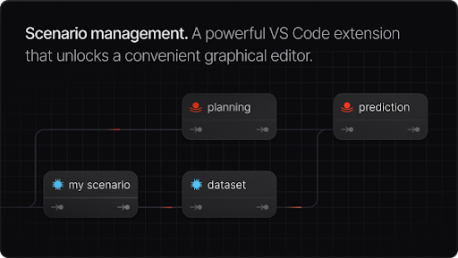
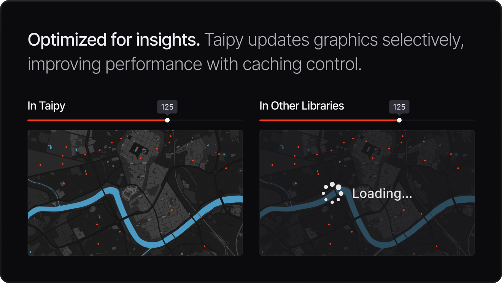
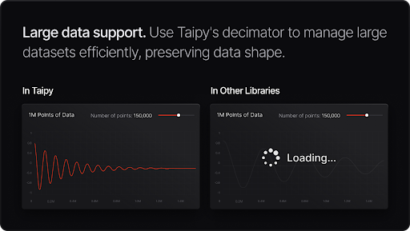

[](https://assorted-son-815.notion.site/Hacktoberfest-2024-with-Taipy-2a5032a3f01642709e88ffaa5d0d169e)


<div align="center">
  <a href="https://taipy.io?utm_source=github" target="_blank">
  <picture>
    <source media="(prefers-color-scheme: dark)" srcset="https://github.com/Avaiga/taipy/assets/100117126/509bf101-54c2-4321-adaf-a2af63af9682">
    
  </picture>
  </a>
</div>

<h1 align="center">
Build Python Data & AI web applications
</h1>

<div align="center">
From simple pilots to production-ready web applications in no time. <br />
No more compromise on performance, customization, and scalability.
</div>

<br />

<div align="center">

**Go beyond existing libraries**

</div>

<p align="left">
    <br />
    <a href="https://docs.taipy.io/en/latest/"><strong>📚 Explore the docs </strong></a>
    <br />
    <a href="https://discord.com/invite/SJyz2VJGxV"><strong>  🫱🏼‍🫲🏼 Discord support </strong></a>
    <br />
    <a href="https://docs.taipy.io/en/latest/gallery/"><strong> 👀 Demos & Examples </strong></a>
  </p>

&nbsp;

## ⭐️ What's Taipy?

Taipy is designed for data scientists and machine learning engineers to build data & AI web applications.
&nbsp;

⭐️ Enables building production-ready web applications. <br />
⭐️ No need to learn new languages. Only Python is needed.<br />
⭐️ Concentrate on Data and AI algorithms without development and deployment complexities.<br />

&nbsp;

<h4 align="left">
Taipy is a Two-in-One Tool for UI Generation and Scenario/Data Management
</h4>

<br />

| User Interface Generation                                                                       | Scenario and Data Management                                                                        |
| ----------------------------------------------------------------------------------------------- | --------------------------------------------------------------------------------------------------- |
|  |  |

&nbsp;

## ✨ Key Features

  


&nbsp;

## ⚙️ Quickstart

To install the Taipy stable release run:

```bash
pip install taipy
```

To install Taipy on a Conda Environment or from a source, please refer to the [Installation Guide](https://docs.taipy.io/en/latest/installation/).<br />
To get started with Taipy, please refer to the [Getting Started Guide](https://docs.taipy.io/en/latest/getting_started/).

&nbsp;

## 🔌 Scenario and Data Management

Let's create a scenario in Taipy that allows you to filter movie data based on your chosen genre.<br />
This scenario is designed as a straightforward pipeline.<br />
Every time you change your genre selection, the scenario runs to process your request.<br />
It then displays the top seven most popular movies in that genre.

<br />

> ⚠️ Keep in mind, in this example, we're using a very basic pipeline that consists of just one task. However,<br />
> Taipy is capable of handling much more complex pipelines 🚀

<br />

Below is our filter function. This is a typical Python function and it's the only task used in this scenario.

```python
def filter_genre(initial_dataset: pd.DataFrame, selected_genre):
    filtered_dataset = initial_dataset[initial_dataset['genres'].str.contains(selected_genre)]
    filtered_data = filtered_dataset.nlargest(7, 'Popularity %')
    return filtered_data
```

This is the execution graph of the scenario we are implementing

<p align="center">

</p>

### Taipy Studio

You can use the Taipy Studio extension in Visual Studio Code to configure your scenario with no code<br />
Your configuration is automatically saved as a TOML file.<br />
Check out Taipy Studio [Documentation](https://docs.taipy.io/en/latest/manuals/studio/)

For more advanced use cases or if you prefer coding your configurations instead of using Taipy Studio,<br />
Check out the movie genre demo scenario creation with this [Demo](https://docs.taipy.io/en/latest/gallery/other/movie_genre_selector/).


&nbsp;

## User Interface Generation and Scenario & Data Management

This simple Taipy application demonstrates how to create a basic film recommendation system using Taipy.<br />
The application filters a dataset of films based on the user's selected genre and displays the top seven films in that genre by popularity.
Here is the full code for both the front-end and back-end of the application.

```python
import taipy as tp
import pandas as pd
from taipy import Config, Scope, Gui

# Defining the helper functions

# Callback definition - submits scenario with genre selection
def on_genre_selected(state):
    scenario.selected_genre_node.write(state.selected_genre)
    tp.submit(scenario)
    state.df = scenario.filtered_data.read()

## Set initial value to Action
def on_init(state):
    on_genre_selected(state)

# Filtering function - task
def filter_genre(initial_dataset: pd.DataFrame, selected_genre):
    filtered_dataset = initial_dataset[initial_dataset["genres"].str.contains(selected_genre)]
    filtered_data = filtered_dataset.nlargest(7, "Popularity %")
    return filtered_data

# The main script
if __name__ == "__main__":
    # Taipy Scenario & Data Management

    # Load the configuration made with Taipy Studio
    Config.load("config.toml")
    scenario_cfg = Config.scenarios["scenario"]

    # Start Taipy Orchestrator
    tp.Orchestrator().run()

    # Create a scenario
    scenario = tp.create_scenario(scenario_cfg)

    # Taipy User Interface
    # Let's add a GUI to our Scenario Management for a full application

    # Get the list of genres
    genres = [
        "Action", "Adventure", "Animation", "Children", "Comedy", "Fantasy", "IMAX"
        "Romance", "Sci-FI", "Western", "Crime", "Mystery", "Drama", "Horror", "Thriller", "Film-Noir", "War", "Musical", "Documentary"
    ]

    # Initialization of variables
    df = pd.DataFrame(columns=["Title", "Popularity %"])
    selected_genre = "Action"

    # User interface definition
    my_page = """
# Film recommendation

## Choose your favorite genre
<|{selected_genre}|selector|lov={genres}|on_change=on_genre_selected|dropdown|>

## Here are the top seven picks by popularity
<|{df}|chart|x=Title|y=Popularity %|type=bar|title=Film Popularity|>
    """

    Gui(page=my_page).run()
```

And the final result:


&nbsp;

## ⚒️ Contributing

Want to help build Taipy? Check out our [**Contributing Guide**](https://github.com/Avaiga/taipy/blob/develop/CONTRIBUTING.md).

## 🪄 Code of conduct

Want to be part of the Taipy community? Check out our **[Code of Conduct](https://github.com/Avaiga/taipy/blob/develop/CODE_OF_CONDUCT.md)**

## 🪪 License

Copyright 2021-2024 Avaiga Private Limited

Licensed under the Apache License, Version 2.0 (the "License"); you may not use this file except in compliance with
the License. You may obtain a copy of the License at
(Apache License)[http://www.apache.org/licenses/LICENSE-2.0](https://www.apache.org/licenses/LICENSE-2.0.txt)

Unless required by applicable law or agreed to in writing, software distributed under the License is distributed on
an "AS IS" BASIS, WITHOUT WARRANTIES OR CONDITIONS OF ANY KIND, either express or implied. See the License for the
specific language governing permissions and limitations under the License.
